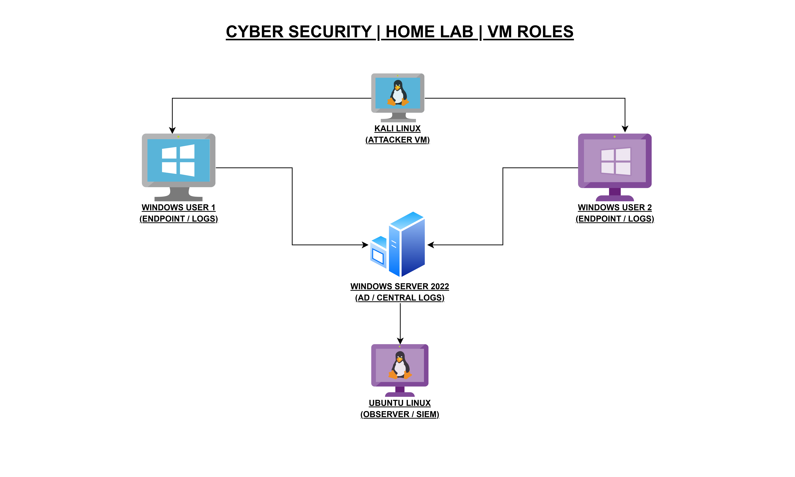

# CyberSecurity-Home-Lab-Intro
Introduction and motivation behind my cybersecurity home lab, including VM roles and lab overview.
# Cybersecurity Home Lab – Introduction

## About This Repository
This repository documents the motivation, purpose, and structure of my cybersecurity home lab.  
It serves as the foundation for all future projects, tasks, and experiments related to SOC analysis and defensive security.

## Motivation
I am transitioning into the cybersecurity field with a strong interest in Security Operations Center (SOC) roles.  
To gain practical, hands-on experience, I designed and built a personal home lab that simulates a real-world enterprise environment.

This lab allows me to:
- Practice log monitoring and analysis
- Understand Windows Active Directory environments
- Simulate attacks and observe detections
- Develop documentation and incident-analysis skills

## Lab Overview
The home lab is built using virtual machines running on a single host system.  
Each virtual machine has a specific role, designed to mirror how systems interact in a real SOC environment.

## Virtual Machine Roles
- **Ubuntu Linux (Observer / SIEM):** Central log collection, monitoring, and alerting  
- **Windows Server 2022:** Active Directory, authentication services, and centralized logging  
- **Windows 10 User 1:** Simulated user endpoint generating activity logs  
- **Windows 10 User 2:** Simulated user endpoint generating activity logs  
- **Kali Linux:** Attack simulation for testing detection and response

## Lab Architecture Diagram
The diagram below illustrates the high-level roles of each virtual machine and their interaction within the home lab.

## What’s Next
Future repositories will document:
- Detailed virtual machine configurations
- Individual SOC tasks and mini-labs
- End-to-end security projects with detection and analysis
